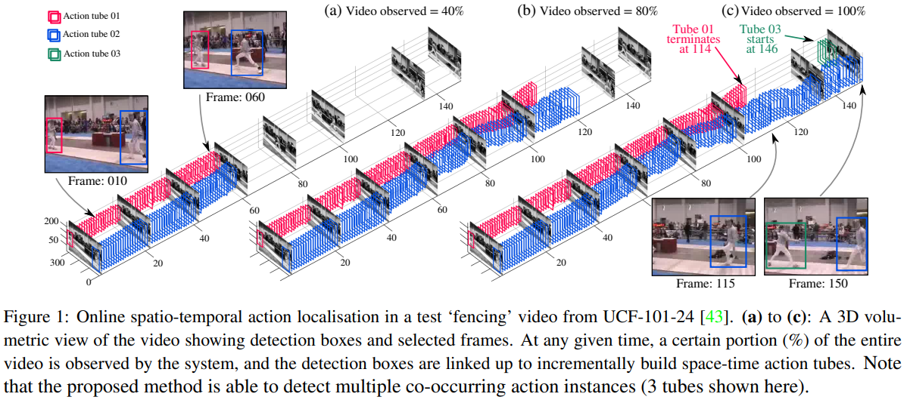
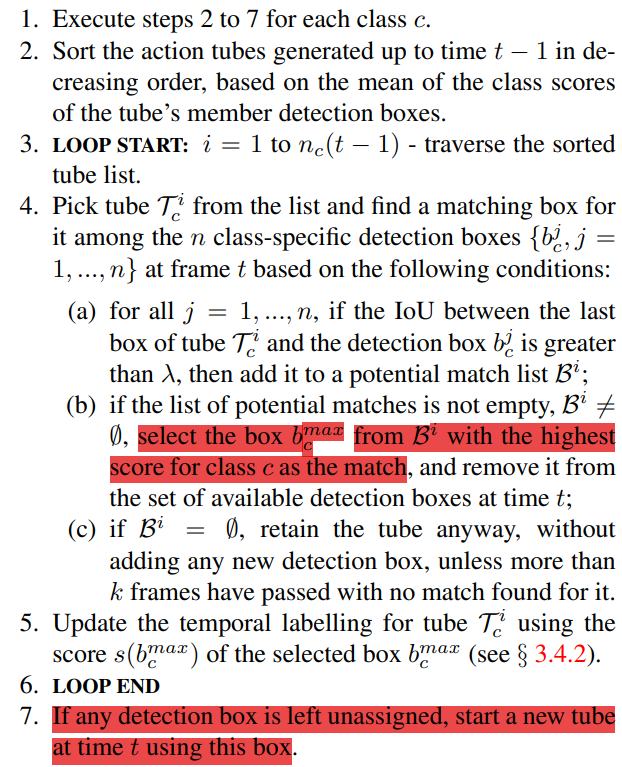
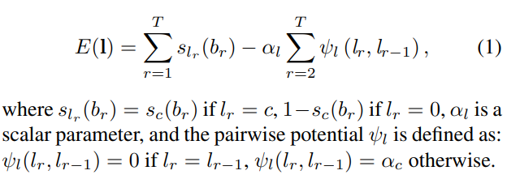
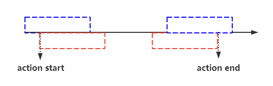
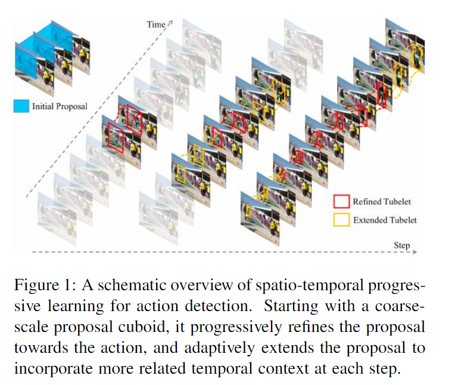

# 2021.11.8 组会

## 1. 上周工作

+ 论文阅读：
  + STEP: Spatio-Temporal Progressive Learning for Video Action Detection  -  CVPR 2019
  + Tube Convolutional Neural Network (T-CNN) for Action Detection in Videos - ICCV 2017
  + Quo Vadis, Action Recognition? A New Model and the Kinetics Dataset - CVPR 2017
  + Recurrent Tubelet Proposal and Recognition Networks for Action Detection - ECCV 2018
  + Online Real-time Multiple Spatiotemporal Action Localisation and Prediction - arxiv 2017
  + Objects as Points - arxiv 2019

+ 论文复现：

  | No   | num of frame | datasets | frame-mAP | frame-mAP(paper) | frame-mAP(best model) |
  | ---- | ------------ | -------- | --------- | ---------------- | --------------------- |
  | 1    | 16           | UCF 24   | 80.8%     | 80.4%            |                       |
  | 2    | 16           | JHMDB21  | 58.99%    | 74.4%            | 70.57%                |
  | 3    | 32           | JHMDB21  | 55.83%    |                  |                       |
  |      |              |          |           |                  |                       |

+ STEP 代码阅读（没有公开tube生成的代码）。

## 2. 本周汇报

### 2.1. Spatio-temporal action detection任务要求

+ 需要对视频中的目标进行时序及空间上定位，同时对其行为进行分类。

+ 已有方法可以分为两类：

  + 逐帧预测：即对视频中的每一帧独立进行预测，之后将每帧的预测结果进行连接，得到上图的输出结果。
  + 逐切片预测：将视频切成大小相同的切片作为输入，一次获得一个切片的预测结果，之后将不同切片的结果进行连接。

  > 逐帧预测的方法没有利用时序信息，网络性能有限。但是YOWO也是逐帧进行预测的。

  + 两类方法的共同点都是模型本身不具备判别时序边界的能力，需要使用连接算法来生成最后的输出结果，即一系列的bbox及类别标签。 

+ 评价指标：

  + frame-mAP：对单帧结果进行评价。
  + video-mAP：对action tube进行评价，只有当整个视频中每帧的平均mIoU超过阈值，且行为标签预测正确才将action tube视为正确预测。

+ frame-mAP判断模型在单帧上的性能，没有考虑帧前后bbox的连续性，相当于将行为识别的任务视为了一个单帧图像的目标检测，不能够很好的反映模型的性能。
+ video-mAP能够考虑真个视频上模型的性能，但是容易受到所使用的连接算法的性能影响，不能很好的反映模型本身的性能，所以很多方法主要还是使用frame-mAP作为性能指标。

### 2.2 连接算法

#### A. Online Real-time Multiple Spatiotemporal Action Localisation and Prediction

+ 研究目的：已有的行为识别方法都是offline且运行速度达不到实际应用的水准。作者使用实时的SSD作为定位和分类网络，并提出了一个**online的连接算法**。

  

+ Tube 生成算法

+ tube会从视频的首帧开始生成，直到视频末尾，并没有考虑区分行为的时序边界，所以Step 5会对得到的tube进行时序上的裁剪，得到行为的时序边界。

+ 做法是将该问题视为一个二分类问题，判断tube中每一帧是否属于行为，最大化每个tube的energy函数：

  

+ 可以看到对某一帧而言，E(I)仅与当前帧与前一帧有关，可以视为一个马氏链。该最大化问题可以通过Viterbi算法解决：

  [维特比算法 - 维基百科，自由的百科全书 (wikipedia.org)](https://zh.wikipedia.org/wiki/维特比算法)

  该算法的优点在于，随着tube长度的增加（即观察值数量增加）计算复杂度呈线性增长。

#### B. Action Tubelet Detector for Spatio-Temporal Action Localization

+ ACT Detector一次生成一个clip的结果，即一个tubelet。在上面方法的基础上进行拓展，进行tubelet间的连接。

给定一个video，按相同长度K的切片，不同切片间有重叠（K-1帧重叠），对每个切片分别进行预测。每个切片中保留得分最高的N个tubelet，目的是得到tubelet之间的连接，该连接用link表示。

> 初始化：对首帧对应的tubelet中的每个tubelet开启一个link，若切片中的tubelet没有与任一link连接，则该tueblet开启一个新的link。
>
> 1. Execute step 2 to 6 for each class c
> 2. Sort the tubelet links generated up to time t - 1in decreasing order, based on the mean of the class scores of the link's member tubelet. (ACT predict a score for each tubelet)
> 3. LOOP START: i = 1 to nc(t-1) - traverse the sorted link list.
> 4. Pick link $L_c^i$ from the list and find a matching tubelet for it among the n class-specific tubelets $\{t_c^j,j=1,\cdots,N\}$ at tubelet starting at frame t based on the following conditions:
>    1. for all j = 1,...,N, if the overlap between the last tubelet of the link and the tubelet $t_c^j$ is greater than $\tau$, then add it to a potential match list $\mathcal{B}^i$
>    2. if the list of potential matches is not empty, $\mathcal{B}^i\ne \Phi$, select the tubelet $t_c^{max}$ from $\mathcal{B}^i$ with the highest score for calss c  as the match, and remove is from the set of available detection boxes at time t;
>    3. if $\mathcal{B}^i=\Phi$, retain the link anyway, unless more than k frames have passed with no match found for it.
> 5. LOOP END
> 6. If any detection tubelet is left unassigned, start a new link at time t using this tubelet.

+ 没有使用Viterbi来判别时序边界，ACT中每个tube的预测就能决定是否为行为的开头或者结尾。

**问题：时序边界处的相邻两个切片间得分差距，即bbox重合重叠程度相差大不大？模型训练中仅对action start-end间的切片进行学习，对这之外的切片表现如何未知，可能会使时序边界不准确。**

#### C. STEP: Spatio-Temporal Progressive Learning for Video Action Detection

+ 为了解决ACT Detector不能够处理长视频切片的问题，引入了多阶段方法。随着Step数的增加，预测得到的bbox更加接近真实值，同时也能够使用更长的视频切片，提供更多的时序信息。
+ Tubelet Linking：
  + 基于ACT的Tubelet Linking算法，取消了开头的NMS操作，保留了更多的候选结果。
  + 使用动态规划（Viterbi 算法）对生成的action tube进行时序上的裁剪，是的action tube中连续的bbox的classification得分平滑变化。

## 下周工作

+ 论文阅读：继续阅读行为识别相关的论文，并补充经典论文的阅读。
+ 论文复现：MOC、STEP的复现，以及YOWO在AVA、MultiSports数据集上的实验。