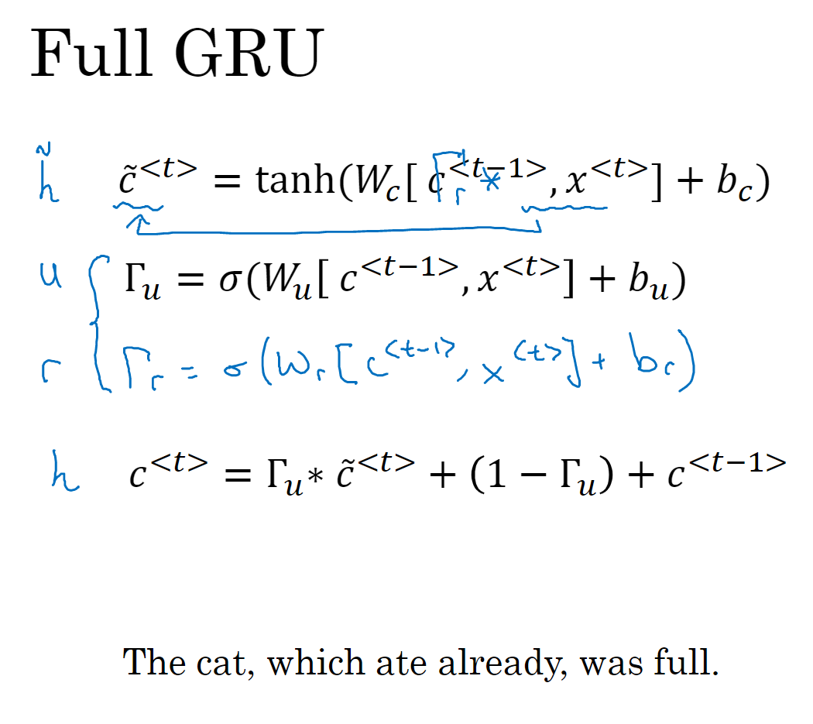

# Sequence Models.  Andrew Ng

## 1. 循环神经网络

### 1.6 语言模型和序列生成

+ **其中损失函数的设计：**假设y2预测错误，假设为sleep，且y3也预测错误，假设为day，此时对y3的交叉熵损失不就使得网络学得sleep后应跟15了吗？**是否应该分布进行学习，即每次回归一个时间步，且将上一个时间步的真值作为输入？**

### 1.7 对新序列采样

+ 对每个时间步的输出，每次从词典中按照当前时间步输出的概率分布进行随机采样，作为当前时间步的输出结果。也就是说**RNN是基于极大似然估计来进行训练，即训练集中出现的词的概率最大，但是文本生成时通过随机采样生成。**

### 1.9 GRU单元

+ RNN的每个时间步仅用当前的特征进行预测，即$a^{<t>}$，而GRU通过两个门来保持过去时间步的特征，即$c^{<t>}$来保持依赖信息。理论上只要u门在不相关的单词上输出值为0，那么句子前端的cat信息就可以传递到句子后端，帮助判断助动词的单复数。

### 1.10 长短期记忆 LSTM

## 2. 自然语言处理与词嵌入

### 2.5 学习词嵌入

+ 学习语言模型，就将预测词的前几个单词作为上下文；若仅仅想要学习词嵌入，则可以选择前后或者附近的一个单词作为上下文。

### 2.6 Word2Vec

+ 上图中最后一种方式，使用skip gram来学习词嵌入，但是对每个词的预测softmax需要大量的计算量来计算分母。

##  3. 序列模型和注意力机制

### 3.1 基础模型

+ 编码器用于输入序列信息，解码器用于生成序列输出。

### 3.2 选择最优可能的句子

+ 语言模型相当于输入零向量时的解码器，而机器翻译相当于在给定句子下的解码器，此时需要求的不是从输入概率分布中选择输出词语，而是选择使条件概率最大的句子，作为翻译的结果。

+ 由于句子的搜索空间与句子长度呈指数型增长，一种方式是使用贪婪算法选择输出词语，但是可能生成的句子并不是全局最优的。

