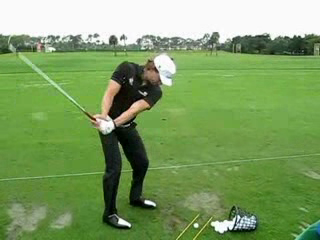

# 2021.11.16-11.22 组会

## 1. 上周工作

论文阅读：

+ SlowFast Networks for Video Recognition - ICCV 2019
+ Deep Layer Aggregation - CVPR 2018
+ Actionness Estimation Using Hybrid Fully Convolutional Networks - CVPR 2016
+ Learning Spatiotemporal Features with 3D Convolutional Networks - ICCV 2015
+ (在读) Fast and Accurate Action Detection in Videos With Motion-Centric Attention Model - TCSVT 2020

论文复现：

+ YOWO在JHMDB上的复现

  + 增加训练epoch数（10 -> 20）
  + 设置YOWO的2D backbone freeze为False
  + 通过抽查发现使用的annotation与YOWO作者提供的存在偏差，改用annotation中的label进行test。

  几种方式的得到的model都达不到论文中的性能，计划使用其他论文中提供的jhmdb label进行实验。

+ YOWO在 AVA 上的复现
  + 作者没有提供在AVA上的性能，复现得到的结果为 val : mAP 0.18

## 2. 汇报

### JHMDB 21

从HMDB51数据集中选择了21个行为类别进行2D joint position、scale、viewpoint、segmentation等的标注。一共包含928个处理好的视频片段，每个行为类别包含36-55个视频片段，每个片段包含15-40帧，共标注31838帧图像。其中70%用于训练，30%用于测试，共有三个划分好的训练测试集，都是随机生成的。

+ 排除了HMDB51中以面部表情为主、人与人之间进行交互、进行特定动作的行为类别，得到单人的行为类别：

> brush hair, catch, clap, climb stairs, golf, jump, kick ball, pick, pour, pull-up, push, run, shoot ball, shoot bow, shoot gun, sit, stand, swing baseball, throw, walk, wave

+ 示例

 

+ 特点
  + 每个视频片段仅包含一个人体目标，一个行为类别，且该行为从视频开头持续到视频结束。**即没有行为时序边界的信息**。

## UCF101-24

从UCF101中选择了24个运动类别，包含3207个未处理的视频片段，**即包含空间及时序上的标注**。

> Basketball、Biking、 CricketBowling、Fencing 、 GolfSwing 、IceDancing、PoleVault 、SalsaSpin 、Skiing、SoccerJuggling、TennisSwing 、 VolleyballSpiking、BasketballDunk、Cliff、Diving、FloorGymnastics、HorseRiding、LongJump、RopeClimbing  SkateBoarding、Skijet、Surfing、TrampolineJumping、WalkingWithDog。

+ 示例

+ 特点
  + 每个视频片段中可能出现包含多个人体实例的视频帧，也可能出现不包含人体实例的视频帧。
  + 每个视频片段仅包含一个类别的行为。

## AVA

+ 提出动机：UCF及JHMDB的规模较小，同时行为的语义层级较高。AVA提出了元行为（Atomic Visual Actions），包含了日常生活中最基础的动作。
+ 对Kinetics数据集中的视频进行标注，其中的来源于电影及电视剧。AVA对每个视频的15-30min的部分进行标注，每一秒进行一帧的标注。

+ AVA中的行为类别可以概括为四类：

  + Pose：standing, sitting, walking, swimming etc
  + Interactions with objects: Carry/Hold etc
  + Interactions with other persons: Watch, Talk to

  

+ 特点：

  + 一个人体实例可能同时属于多个行为类别，一帧中可能包含多个人体实例也可能没有人体实例。
  + 一个视频片段中可能包含多个类别的行为。

## MultiSports

+ 提出动机：已有的数据集可以分为两类

  + 密集标签的高层语义行为：这类数据集较为简单，与现实应用场景的差别较大。（UCF、JHMDB）
  + 稀疏标记的元行为：注重空间定位，但是时序边界不清晰；元行为粒度太小，不需要复杂的推测就可获得，较为简单。

  面对现实的应用场景需要提出一个新的数据集：

  + 多人场景下，不同的人体进行不同类别的行为。
  + 具有清晰的时序、空间边界。
  + 行为的粒度合适，行为的推断不能过于简单也不能过于复杂。

+ 基于现实场景的需要选择四类运动的视频进行标注：Basketball, Volleyball, football, aerobic gymnastics

+ 标注过程：
  1. 请专业运动员对不同运动中的不同行为进行定义，生成说明书。
  2. 运动员进行类别及时序的定位。
  3. 其他人员进行空间上的标注。

​	最终生成的数据集包含3200个视频片段、37701个标注的行为实例、902k个bbox。

+ 特点
  + 更加困难
  + 图像质量更高，720P或10180P
  + 视频从不同的国家及地区选择，使得数据集与现实的运动分析的偏差较小。
  + 针对现实的运动分析的应用场景。
  + **行为的边界有明确的定义**

## 后续工作

+ 有一定的想法，这周将与蔡文杰师兄讨论。
+ 对相关方法的复现以及添加MultiSports的实验代码。