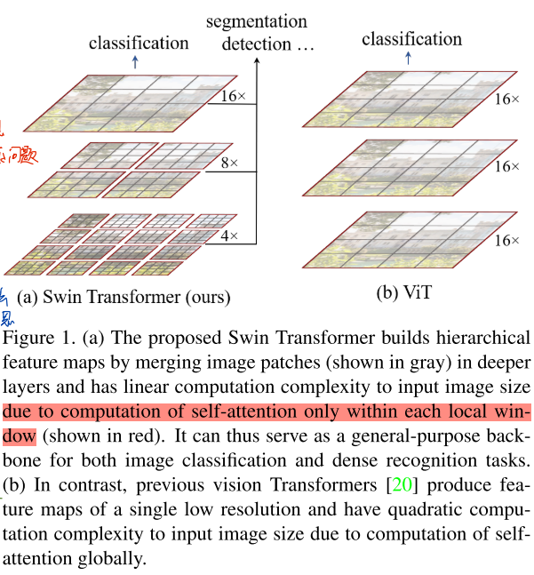
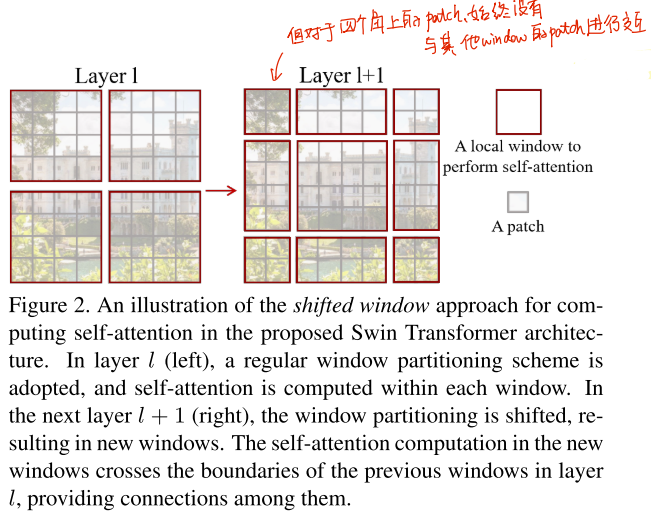
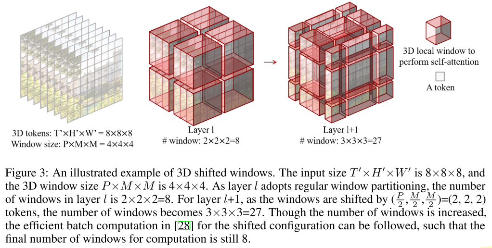

# 2021.12.6

## 上周工作

### 论文阅读：

(ECCV 2016) Multi-region two-stream R-CNN for action detection

(2021) Swin transformer: Hierarchical vision transformer using shifted windows

(2021) Video Swin Transformer

(ICCV 2019) GCNet: Non-local Networks Meet  Squeeze-Excitation Networks and Beyond 

(CVPR2018) Squeeze-and-excitation networks.

(ECCV 2020) Disentangled non-local neural networks

(ICCV 2019) An empirical study of spatial attention mechanisms in deep networks.

### 实验：

MMAction框架学习，并将DNL、GC、SE模块进行实现。

## 汇报

### (2021) Video Swin Transformer

Transformer在NLP中获得成功之后，许多工作将Transformer引入视觉领域，并且发现在目标检测、语义分割、行为识别等领域十分有效。

但是将自注意力引入视觉中存在问题：**视觉实体的尺度存在差异；图像的像素数量远远大于一个句子中的单词数。**

已有方法：

+ 局部自注意力 + 滑窗  ： 对每个query，其对应的key集合不同，计算效率不足。

+ Vision Transformer 类方法：将image划分为固定数量个window，计算复杂度 $O(n^2)$；feature map的分辨率较小，不适用于目标检测、语义分割等任务。

+ 与ViT相反，Swin Transformer保持每个window的大小，此时每个window内自注意力的计算开销保持相同，window的个数随图像的大小线性变化，此时计算复杂度变为 $O(n)$。
+ 同时，每个window的自注意力计算仅需要读取一次，即可完成计算。

**带来的问题：不同window之间缺乏联系，限制了模型的建模能力。**

+ 将window进行平移，步长为window size的一半，此时window数量增加。对于四个角的window，依旧没有与其他window进行交互。
+ 将不足window大小的窗口进行拼接，再进行计算。通过不同window的交互获取全局的注意力。

Swin Transformer能够处理大分辨率的图像，能够作为多个视觉任务的backbone。Video Swin Transformer则是将Swin Transformer拓展至视频领域。

## 下周工作

+ 提出的想法未与实际问题相结合。结合实际进行实验，多花时间在自身想法的实验上。
+ 有关Transformer在视觉领域中，特别是视频领域下应用的论文。
+ 周一至周五进行论文阅读，周末进行整理。