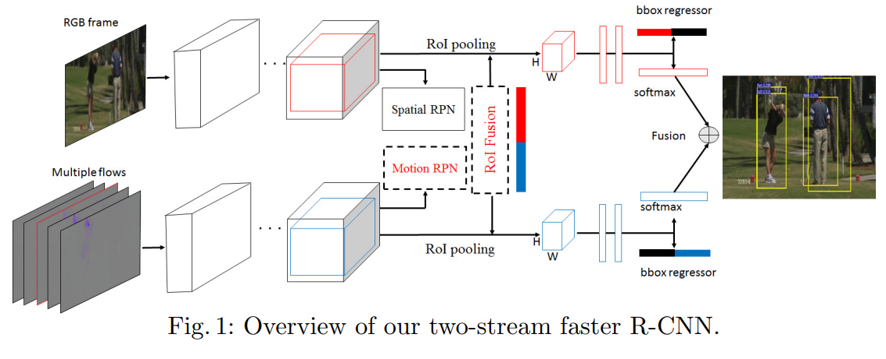
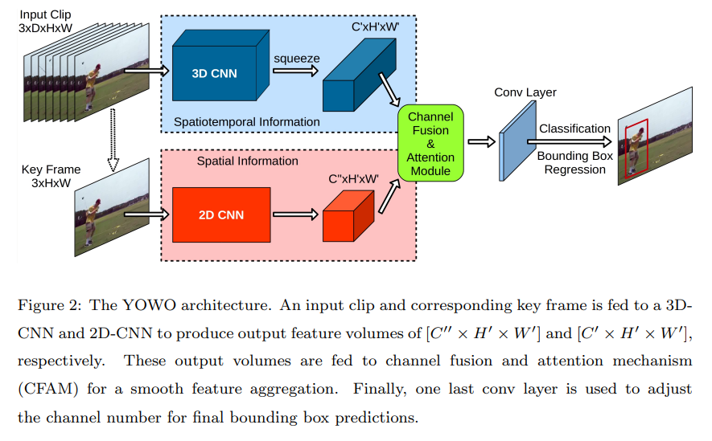
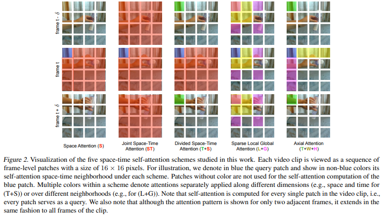

# 讨论 2021.11.26

## 1. Two stream CNN

### (ECCV 2016) Multi-region two-stream R-CNN for action detection

+ 通过两个分支分别提取Appearance和Motion信息：
  + Appearance分支：通过单张RGP图像提取空间信息。
  + Motion分支：通过多张Optical Flow concat之后提取时序信息。

> 除了使用Optical Flow提取时序信息，也有方法将RGB特征在通道上进行concat之后进行卷积；或者使用RNN进行时序信息的提取。

### You Only Watch Once: A Unified CNN Architecture for Real-Time Spatiotemporal Action Localization

YOWO的工作可以总结为两点：

1. 使用3D卷积从多张RGB图像中提取时序信息。
2. 通过注意力机制将Appearance和Motion信息进行融合。

## 2. 问题：3D卷积在时序信息提取上并不是最好的。

### (CVPR 2017) Quo Vadis, Action Recognition? A New Model and the Kinetics Dataset

+ 2D卷积假设了在空间上两个维度是对称的，这非常自然，但是时间跟空间并不对称。
  + 论文中认为时序上的感受野要与空间上的感受野保持一致，即时序上的感受野增长与空间不匹配，性能都会有所下降。文中通过取消backbone前几次的3D池化来进行适配。

### 组会

褚涛师兄对使用3D卷积提取时序信息比较存疑，3D卷积在医学图像处理中应用较广，因为医学图像中是一组图像切片，组成了一个三维空间，三个维度都是对称的。

+ 当时师兄建议我阅读一下视频目标检测的文章，说视频目标检测没有使用3D卷积，我还没有来得及阅读。

### (ICML 2021) Is Space-Time Attention All You Need for Video Understanding?

+ 空间注意力和时序注意力的次序影响性能：
  + 先计算时序注意力的性能较高，论文中没有给出解释。个人理解时序注意力需要在时序上连续的同一位置进行提取。若先进行空间注意力的提取，同一个patch中包含其他不同patch的信息，且时序上同一patch可能包含不同的patch。

### 想法1

在Motion分支上进行时序上的卷积（$1*1*c*t$）或者使用时序注意力，即将每一张图片视为一个token。

### 其余想法

1. 性能评价需要排除连接算法的影响，可以将clip作为评价的单位，即考虑单帧性能时，同时考虑前后k帧的结果。
2. MOC Detector