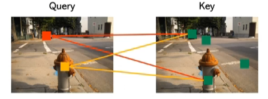
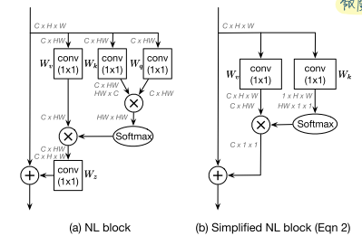
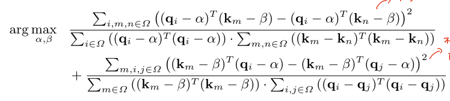

# 2021.12.5 论文整理

## Non local Network中存在的退化现象

### 自注意力机制

+ 利用token与其他tokens的关系构建长距离依赖，转换token的特征。
+ 通过对Value的加权求和，其中权重由Query和Key的内积计算得出。

代表性的工作: Non local Neural Networks(CVPR 2018), Relation Networks(CVPR 2018)....

被应用在很多的视觉任务中，包括图像分类、目标检测、语义分割、行为识别等。

### 退化现象

**问题：在视觉任务中，自注意力是否真的能够学到不同token之间的相关关系？**

预期的效果是对于不同的query，会受到不同的key的影响。

但是通过可视化，发现实际得到的注意力图退化为了一个全局的一阶模型。

基于该发现，(ICCV 2019) GCNet: Non-local Networks Meet  Squeeze-Excitation Networks and Beyond 将Non Local Block进行简化，将冗余的pairwise计算优化为计算一个与query无关的全局注意力图。在减少计算量的同时，保留了NL Block的性能。

(ECCV 2020) Disentangled non-local neural networks 则在此基础上进行更深入的讨论。

#### Why?

+ 对注意力计算的数学表达式进行拆解，可以得到两项，其中前一项与query有关，第二项与query无关。

> $\mu$ 的选择可以通过求解损失函数，使得不同的query-key对权重差异最大。
>
> 
>
> + 取min并将函数取负，此时该函数的海森矩阵是一个半正定矩阵，即该函数是一个凸函数。可以通过求导数为零，得到全局最优解，即q、k均值。

其中前一项的操作被称作白化，个人理解即将两项特征进行解耦。

**可以看出两项一起学习时，性能还比不上单独使用unary一项的性能。Why？**

将pairwise项与unary项拆解开，可以看到两者呈相乘关系，这就带来一个问题。

两项的梯度相互耦合，若一项的值接近于零，另一项的学习也将会停止。将乘法操作转变为加法，两者就解耦了，此时两者的梯度也解耦了。

通过可视化发现，两项对应的是完全不同的信息，pairwise项对应与query同类别的区域，unary则注重不同类别的边界。

